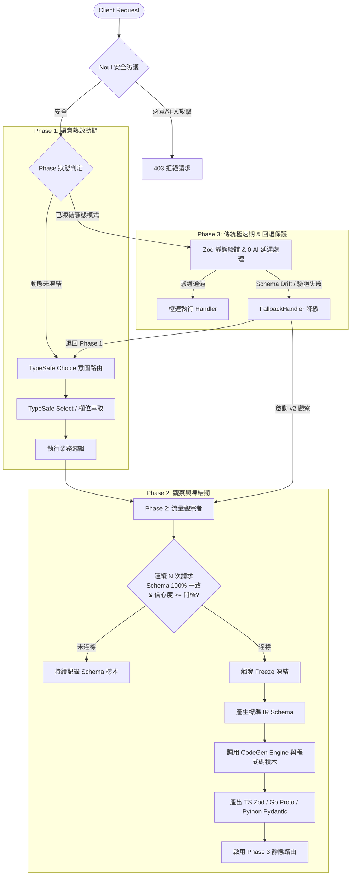

# JIT Protocol Synthesis Framework (jit-api)

> **基於 TypeSafe (Jev) 的動態至靜態 API 生成架構**  
> *Dynamic Semantic Negotiation ➔ Static Code Freeze ➔ Self-Evolving Fallback*

---

## 📖 執行摘要 (Executive Summary)

**JIT 協定合成（Just-In-Time Protocol Synthesis）** 是一種新型態的微服務通訊與 API 開發典範：
- **在開發初期**：前後端無需預先定義死板的 Protobuf 或 OpenAPI Schema。工程師或 AI Agent 只需以自然語言宣告業務意圖，Client 端即可發送語意鬆散的 Payload。伺服器端依賴 **TypeSafe (Jev)** 作為微型決策引擎，在毫秒級內進行意圖路由、列舉萃取與安全過濾。
- **在系統穩定後**：系統在背景自動監控流量結構（Schema Stability），當某路由結構達到 100% 一致且信心度達標時，自動觸發「凍結機制」，利用預置無幻覺程式碼積木（AST Blocks）編譯為二進制 gRPC (`.proto`)、TypeScript Zod 驗證器、Go Struct 或 Python Pydantic 模型。
- **進入極速期**：通訊流量完全繞過 AI，直接走純靜態路徑，達成 **0 毫秒 AI 延遲、0 額外運算成本** 的極致效能。
- **自我演進回退（Fallback）**：當 Client 商業邏輯更新並傳入新欄位（Schema Drift）導致靜態驗證失敗時，系統自動將請求降級（Fallback）回 Phase 1 語意模式，無縫處理請求並啟動 v2 演進觀測，保證系統零中斷。

---

## 🚀 快速開始 (Quick Start)

三種啟動方式，任選一種即可開啟 **Web 視覺化控制台 + 規格編輯器 + k6 壓測 + 內建終端機 + MCP 協定**：

### 方式 A：NPX 一鍵執行（推薦，隨處可用、零污染）
在任何專案目錄下：
```bash
# 1. 初始化 specs/ 規格目錄與範例
npx jit-api init

# 2. 啟動開發模式 (含 Web 控制台、Terminal、動態熱重載，Port 3005)
npx jit-api dev

# 3. 啟動生產模式 (高效純 API Gateway、安全防護、僅加載 Stage: prod，Port 3000)
npx jit-api start

# 4. 發布規格快照版本 / 線上快速回滾降版
npx jit-api release 1.0.0 "初次生產穩定發布"
npx jit-api rollback 1.0.0
```

### 方式 B：Docker 一鍵運行（針對完全不想裝 Node/Python 的人）
```bash
# 使用 Docker Compose
docker compose up -d

# 或使用 Docker CLI (自動掛載本地 specs 目錄)
docker run -d -p 3005:3005 -v $(pwd)/specs:/app/specs jit-api
```
*詳細說明請參閱 [Docker 一鍵運行指南](file:///home/toby/documents/projects/jit-api/docs/docker_guide.md)*

### 方式 C：Python 原生 SDK 安裝（PyPI 官方套件）
```bash
pip install jit-protocol
```
```python
from jit_api import JITEngine

engine = JITEngine()
# 立即開始動態協定合成與自動凍結
```

### 方式 D：本地原始碼開發
```bash
git clone https://github.com/your-username/jit-api.git
cd jit-api
./run.sh
```

---

## 🏗️ 架構生命週期 (Lifecycle Phases)



---

## 📂 目錄結構設計

```text
jit-api/
├── .env                     # Phase 1 必備：TYPESAFE_API_KEY
├── SKILL.md                 # 核心：指導開發者 AI Agent 的運作守則
├── core/
│   ├── types.ts             # 核心型態定義 (IRSchema, JevDecision, Context)
│   ├── typesafe_client.ts   # TypeSafe (Jev) API 用戶端封裝 (Choice, Score, Noul)
│   ├── typesafe_router.ts   # Phase 1: 呼叫 Jev 進行動態語意路由與型態轉換
│   ├── observer.ts          # Phase 2: 監聽流量，判定 Schema 是否已穩定並觸發凍結
│   ├── fallback_handler.ts  # 補全機制：Phase 3 遇到未知格式時降級回 Phase 1
│   └── jit_engine.ts        # 統一核心引擎 (整合 Phase 1/2/3/Fallback)
├── blocks/                  # 核心：防幻覺的「程式碼積木」
│   ├── ast_typescript/      # Zod Schema 與 TypeScript 型態樣板
│   ├── ast_golang/          # gRPC .proto (proto3) 與 Go Struct 樣板
│   └── ast_python/          # FastAPI 與 Pydantic v2 樣板
├── compiler/
│   └── codegen_engine.ts    # 負責讀取 Schema 與 blocks，產出最終多語言靜態程式碼
├── examples/
│   ├── demo_lifecycle.ts    # 完整生命週期展示腳本
│   └── mock_services.ts     # 範例業務 Handler (建立帳單、查詢訂單)
└── test/
    ├── typesafe_client.test.ts # TypeSafe API 整合測試
    ├── observer.test.ts        # Schema 穩定度與凍結測試
    ├── codegen.test.ts         # 多語言程式碼生成測試
    └── lifecycle.test.ts       # 端到端熱切換與 Fallback 測試
```

---

## 🚀 快速上手 (Quick Start)

### 1. 一鍵啟動視覺化控制台與 JIT 伺服器 (最推薦)
```bash
./run.sh
```
啟動後瀏覽器打開 **`http://localhost:3005`**，即可使用：
* 🧭 **路由即時觀測**：即時測試自然語言與穩定請求，觀測穩定度進度條與 Phase 3 自動凍結。
* ⚡ **Grafana k6 一鍵壓力測試**：自訂虛擬用戶並發與秒數，實測突破 1,300+ RPS 與 0.47ms 極低延遲。
* 📝 **Markdown API 規格中心**：在線瀏覽/編輯 `specs/*.api.md`，一鍵即時熱加載（Hot-Reload）。
* 📦 **凍結合約代碼檢視**：即時預覽自動生成的 TypeScript (Zod)、Python (Pydantic)、Protobuf (.proto)。
* 💻 **VS Code 風格 Web 終端**：網頁底部內建互動式 PTY Terminal（支援 zsh/bash、快捷鍵 `Ctrl + \``），即時與 Agent 對話、跑測試或執行 CLI，完全不需離開瀏覽器！

### 2. 環境變數設定 (`.env`)
在專案根目錄確認 `.env`（若無金鑰將自動降級使用本地端側小模型 Needle）：
```env
TYPESAFE_API_KEY=your_typesafe_api_key_here
```

### 3. 執行完整端到端生命週期演示
```bash
# TypeScript 雲端 TypeSafe 演示
npm run demo

# TypeScript 本地 Needle 離線降級演示 (無金鑰模式)
npm run demo:needle

# Python (Pydantic Fast-Path) 演示
npm run demo:py
```

### 4. 執行自動化測試
```bash
# 執行 TypeScript 測試 (Vitest, 22/22 tests passing)
npm test

# 執行 Python 測試 (Pytest, conda toby 環境, 11/11 tests passing)
npm run test:py
```

### 5. 完整開發指南 (`docs/`)
詳見完整文件索引 [docs/README.md](file:///home/toby/documents/projects/jit-api/docs/README.md)：
* 🚀 **[Markdown 標記式 API 與 Agent 協同指南](file:///home/toby/documents/projects/jit-api/docs/md_api_guide.md)** — 如何寫 `specs/*.api.md` 並由 Agent 自動合成代碼
* ⚡ **[Grafana k6 壓力測試指南](file:///home/toby/documents/projects/jit-api/docs/benchmark_guide.md)** — Web 一鍵壓測與 CLI 壓測
* 🖥️ **[Server 端整合指南](file:///home/toby/documents/projects/jit-api/docs/server_guide.md)** — Express & FastAPI 底層程式碼
* 📱 **[Client 端調用指南](file:///home/toby/documents/projects/jit-api/docs/client_guide.md)** — 全生命週期呼叫規範

### 6. 建置專案
```bash
npm run build
```

---

## 💻 程式碼使用範例

### 宣告端點（不需預先寫死 Schema）

```typescript
import { JITEngine, JITRequestContext } from './core/index.js';

const engine = new JITEngine({
  stabilityThreshold: 5,  // 連續 5 次相同結構即凍結
  confidenceThreshold: 0.85
});

// 註冊業務 Handler
engine.register({
  route: 'create_invoice',
  description: 'Issue a customer invoice',
  intentCriteria: 'Customer wants to create or bill an invoice for services',
  enumFields: {
    currency: { USD: 'US Dollar', EUR: 'Euro', TWD: 'New Taiwan Dollar' },
    priority: { urgent: 'Urgent priority', normal: 'Normal priority' }
  },
  handler: async (payload: any, ctx: JITRequestContext) => {
    return {
      invoiceId: 'INV-1001',
      customer: payload.customer,
      amount: payload.amount,
      currency: payload.currency,
      phase: ctx.phase,
      aiLatencyMs: ctx.aiLatencyMs
    };
  }
});

// 發送請求 (即使是非結構化或語意模糊也能精準路由)
const res = await engine.execute({
  message: "Please bill Acme Corp for 100 dollars urgently",
  customer: "Acme Corp",
  amount: 100,
  currency: "USD"
});

console.log(res);
```

---

## 🛡️ 邊界處理與安全機制

1. **Noul 即時安全防禦**：
   每個動態請求在進入路由前，自動經由 Jev `noul` 原語過濾 SQL 注入、代碼執行或惡意攻擊，異常評分超過門檻立即阻擋。
2. **Schema Drift 回退保護**：
   在 Phase 3 極速模式下，若客戶端欄位產生演進（例如新型態或額外擴充欄位），靜態驗證失敗將無縫降級回 Phase 1，TypeSafe 重新解析，並自動重啟 Phase 2 收集 v2 穩定結構。
