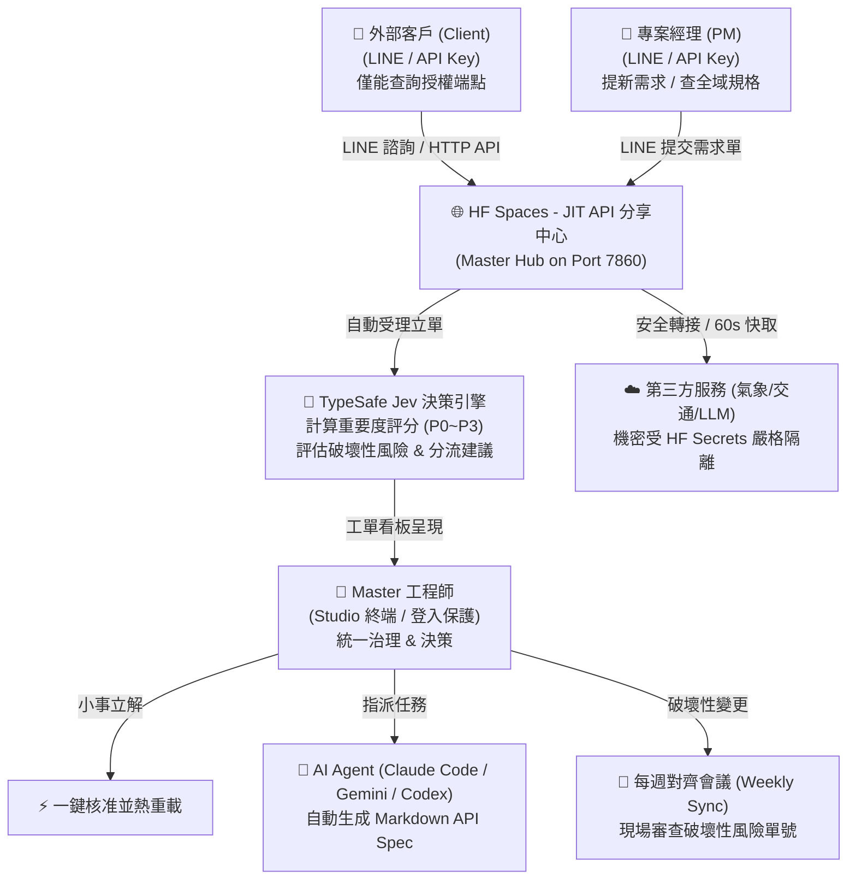

# JIT API 分享中心 (Master Hub) — Hugging Face Spaces 部署與多角色協同指南

> 本指南以 **「企業 API 分享中心 (Master Hub)」** 為例，詳細教學如何在 **Hugging Face Spaces** 零成本部署 JIT API 引擎，並結合 **1 位 Master 總控 + AI Coding Agent (Claude Code / Codex / Gemini CLI) + LINE Bot 多角色智慧協同**，打造高可用、具備頻率限制與第三方機密隔離的現代化 API 轉接共享平台。

---

## 1. 架構藍圖與多角色協同機制

在典型的 API 開發與對外服務情境中，往往面臨三方痛點：
1. **客戶 (Client)**：需要即時介接 API，但常因文檔不全或無法得知變更而來回溝通；且不應看到其他客戶的專屬端點。
2. **專案經理 (PM)**：需要快速驗證新功能、替新客戶提新 API 需求，但缺少即時的自動化測試環境。
3. **工程師 (Master)**：面對龐雜的需求訊息疲於奔命，改動代碼又擔心破壞舊規格（溜溜球效應）。

### 核心分工矩陣



| 角色名稱 | 權限邊界 (Access Scope) | LINE 互動體驗 | API 呼叫能力 |
| :--- | :--- | :--- | :--- |
| **👑 Master (總工程師)** | 全域最高治理權限，掌握主機與 `./run.sh`、密鑰管理、規格編輯、壓測與工單核准 | 可接收即時告警，監控全系統運作 | 全域存取 (`*`)，不受限 |
| **💼 PM (專案經理)** | 系統級功能查詢、可提議新客戶 API 規格與測試需求 | 可自由查詢所有 API 規格、狀態，提交新增/變更單 | 全域測試存取 (`*`)，支援高頻率 |
| **🏢 Client (外部客戶)** | 僅能存取被授權的專屬端點 (如 `/api/weather`, `/api/users`) | 查詢被嚴格隔離，無法窺探其他客戶資料或系統機密 | 依發行之 API Key 限制，支援 Sliding-Window 速率限制 (如 60 次/分) |
| **🛠️ Dev (協同工程師)** | 協同開發與端點驗證 | 可觸發 Mock 測試、查詢規格細節 | 全域存取，用於端對端測試 |

---

## 2. Hugging Face Spaces 部署流程

Hugging Face Spaces 提供永久運行的免費 CPU 容器，極度適合做為企業 API 分享中心與 Webhook 接收站。

### 步驟 1：建立 Hugging Face Space
1. 登入 [Hugging Face](https://huggingface.co/)，點選右上角 **New Space**。
2. 設定 Space 資訊：
   - **Space name**: 如 `jit-api-hub`
   - **License**: MIT
   - **Select the Space SDK**: 選擇 **Docker** (或 **Node.js**)
   - **Space hardware**: 免費 CPU basic (2 vCPU, 16GB RAM 足以應付萬級請求)
3. 點擊 **Create Space**。

### 步驟 2：配置 HF Secrets 環境變數 (關鍵資安防護)

> [!IMPORTANT]
> **嚴禁將敏感機密寫入 Git 程式碼！** 
> JIT API 引擎支援透過 Hugging Face Secrets 注入環境變數，本機 Git 倉庫預設由 `.gitignore` 將 `.jit/upstream_secrets.*`、`.jit/apikeys.json`、`.jit/master_session.json` 完全排除，確保**零機密外洩 (Zero Secret Leakage)**。

在你的 Space 頁面中，進入 **Settings** -> **Variables and secrets**，新增以下 **Secrets**：

| Secret 名稱 | 說明與範例值 | 必須性 |
| :--- | :--- | :--- |
| `MASTER_PASSWORD` | **Master 管理者登入密碼** (如 `MySuperSecurePass2026!`)。未設定時僅允許本機免密登入，上雲端請務必設定以防未授權控制。 | **強制 (強烈推薦)** |
| `UPSTREAM_<REF>` | **第三方轉接 API 金鑰**。例如 `UPSTREAM_CWA_KEY` (中央氣象署金鑰)、`UPSTREAM_TDX_KEY` (交通部 TDX 金鑰)。引擎將自動在 Markdown 規格書以 `ref: cwa_key` 關聯。 | 選填 (有加值轉接需求時) |
| `TYPESAFE_API_KEY` | TypeSafe Jev 決策引擎 API 金鑰 (用於自動評分與破壞性評估)。 | 選填 (未設定自動啟用 Needle 本地降級模式) |
| `LINE_CHANNEL_SECRET` | LINE 官方帳號的 Channel Secret (用於校驗 Webhook 簽章)。 | 選填 (啟用 LINE 機器人時) |
| `LINE_CHANNEL_ACCESS_TOKEN` | LINE 官方帳號的 Channel Access Token (用於發送訊息通知)。 | 選填 (啟用 LINE 機器人時) |

### 步驟 3：推送程式碼至 Hugging Face Space

在本地專案目錄執行：

```bash
# 1. 建立 Git 遠端關聯 (將用戶名與 space 名稱換成你的)
git remote add space https://huggingface.co/spaces/<YOUR_USERNAME>/jit-api-hub

# 2. 推送代碼至 Space
git push space main
```

JIT API 引擎中的 `run.sh` 與伺服器會自動偵測 Hugging Face 環境變數：
- 當偵測到 `SPACE_ID` 或 `SPACE_HOST` 時，自動綁定連接埠 **`7860`** (HF Spaces 預設埠)。
- 自動辨識以 `UPSTREAM_` 開頭之 Secrets，並注入安全的 Upstream Proxy 金鑰池中。
- 自動掛載 Web Studio 介面、ConnectRPC 介面與 LINE Webhook 入口。

---

## 3. 1 位 Master 統一治理與 AI Agent 搭配

在 JIT API 分享中心中，由 1 位 Master 總控整個架構，並搭配 Claude Code、Codex 或 Gemini CLI 執行自主式 API 生成與維護。

### 1. Master 登入防護與暴力破解阻擋
- 進入 Space 首頁後，訪客處於**唯讀模式**。
- 點選右上角 **`🔒 訪客模式 (點擊登入)`**，輸入 `MASTER_PASSWORD`。
- 內建暴力破解防禦：若連續輸入錯誤 5 次，系統自動鎖定該 IP 15 分鐘。
- 登入成功後，右上角轉為 **`👑 Master (已授權)`**，解鎖規格編輯、k6 壓測、工單批准與 Web Terminal 終端機權限。

### 2. 工單一鍵生成 AI Agent Prompt
當 LINE 上收到新需求時，Master 無需手動撰寫需求文檔：
1. 進入 Studio 的 **`📱 LINE 協同`** 視圖。
2. 找到待處理工單，點擊 **`🤖 複製 Agent 執行指令`**。
3. 系統自動將包含 **提單人身分、公司、目標端點、重要度評分 (P0~P3)、Jev 建議之 Markdown 補丁** 的結構化 Prompt 複製至剪貼簿：

```text
請使用 JIT API 引擎處理工單 [TKT-8942]：
- 提單人: PM Carol (pm, 公司: Product Ops)
- 目標路由: /api/weather/cwa_forecast
- 優先級: P1 (Jev 評分: 78/100)
- 情境分析: 專案經理提出新端點需介接氣象局預報，且需加值快取。
- 建議行動: AI_AGENT_AUTONOMOUS
- 需求描述: 我們需要一個能查詢各縣市天氣預報的端點，並自動加上 60 秒快取避免被氣象局限速。

- Jev 建議規格:
```markdown
# API: cwa_forecast
Version: 1.0.0
Description: 臺灣縣市天氣預報轉接服務

## Route
Method: GET
Path: /api/weather/cwa_forecast

## Upstream
target: https://opendata.cwa.gov.tw/api/v1/rest/datastore/F-C0032-001
secretRef: cwa_key
authHeader: Authorization
cacheTtlSeconds: 60

## Limits
requestsPerMinute: 60
dailyQuota: 1000
```

請在 specs/ 目錄中撰寫對應的 Markdown API 規格，並執行 ./run.sh 或 npm test 驗證通過。
```

4. Master 只需在終端機貼上執行：
   ```bash
   npx @anthropic-ai/claude-code "貼上上方複製的指令"
   # 或使用 gemini-cli / codex
   ```
   AI Agent 將秒級產出對應規格並通過測試！

---

## 4. LINE Bot 智慧身分判斷與 Jev 重要度評分 (0 ~ 100)

LINE 使用者在分享中心具有明確的權限與重要度分流機制：

### 1. 客戶 (Client) vs PM 權限隔離
- **名冊配置**：在 Studio 的 **`📱 LINE 協同`** -> **白名單管理** 中，Master 可以為每個 LINE 使用者指派身分：
  - 客戶 Alice（公司：ACME Corp）：設定角色為 `client`，授權端點填寫 `/api/weather`。
    - **效果**：Alice 在 LINE 詢問「目前有哪些 API 可以用？」或「查詢 /api/users 規格」時，LINE Bot 僅會列出與回覆 `/api/weather`，其餘端點嚴格隱蔽，確保多租戶資訊安全。
  - 專案經理 Carol：設定角色為 `pm`。
    - **效果**：Carol 在 LINE 擁有全域權限，可查詢全部路由、提議新規格或測試客戶的端點。

### 2. Jev 三維評定指標 (Importance, Urgency, Risk) 與分流處置建議
每一筆來自 LINE 的提單，均會通過 TypeSafe Jev 決策引擎評審 **三個獨立指標**，再依據其多維交集給出綜合處置建議：

#### 📊 Jev 三維指標說明
1. **🌟 重要性 (Importance, 0–100 & HIGH / MEDIUM / LOW)**：
   - 評定需求之**業務價值**、**客戶影響範圍**與**提單者角色權重**（PM 掌管產品主線 80 分起；客戶外部合約交付 75 分起；後端伺服器 65 分起；測試員 50 分起）。
   - 核心業務關鍵字（如：支付、結帳、訂單、認證、氣象、交通）獲得 +15 權重加成。
2. **⏰ 急迫性 (Urgency, 0–100 & CRITICAL / HIGH / MEDIUM / LOW)**：
   - 評定**線上時效壓力**與**服務可用性阻斷**（當機/500/crash/崩潰/無法結帳直接評定為 95 分 CRITICAL；緊急/立刻/今天前評定為 85 分 HIGH；下週/儘速評定為 70 分 MEDIUM；未來/優化評定為 25 分 LOW）。
3. **⚠️ 危險性 (Risk / Breaking Hazard, 0–100 & HIGH / MEDIUM / LOW)**：
   - 評定**破壞性風險 (Breaking Change)** 與架構衝擊（刪除欄位、更動型態、drop field 評定為 80~100 分 HIGH；修改既有端點評定為 25 分 LOW；純新增端點/相容擴展評定為 10~20 分 LOW）。

#### 💡 處置建議決策矩陣 (Triage Advice Matrix)

| 決策建議 (Triage Action) | 判定觸發條件 | 建議說明與工作流 |
| :--- | :--- | :--- |
| **⚡ Master 立即處置**<br/>(`MASTER_DIRECT_HANDLE`) | **急迫性: CRITICAL** 或<br/>(**急迫性: HIGH** 且 **危險性: LOW**) | 線上重大事故或急迫且無破壞性的小事，Master 當場一鍵批准或排查熱重載。 |
| **📅 週會討論**<br/>(`DISCUSS_WEEKLY_MEETING`) | **危險性: HIGH**<br/>(Breaking Change / 刪改欄位) | 涉及既有客戶合約與介面相容性，嚴禁私自變更，強制列入每週全體對齊例會評審。 |
| **🤖 交由 AI Agent 處理**<br/>(`AI_AGENT_AUTONOMOUS`) | **重要性: HIGH / MEDIUM** 且<br/>**危險性: LOW / MEDIUM** | 業務重要度明確且危險性受控，可直接指派 Claude Code / Codex / Gemini CLI 自動撰寫 Spec。 |
| **❌ 建議駁回 / 暫緩**<br/>(`REJECT`) | 需求描述模糊 (`NEED_MORE_INFO`)、重複 或<br/>**重要性: LOW** 且無急迫性 | 缺乏具體參數型態或價值不足，駁回請提單者補充，優先維護既有架構穩定。 |

---

## 5. 每週定期對齊會議與日常維運流程

JIT API 分享中心讓團隊建立高效的維護節奏：

### 流程 A：日常非同步維運 (Daily Triage)
1. **客戶 / PM 透過 LINE 發話**：LINE Bot 即時自動受理、生成單號（如 `#TKT-7128`），並自動回傳 Jev 初步評級。
2. **Master 在 Studio 巡檢**：
   - **若是小事 / 簡單端點 (P2)**：Master 點選 **`✅ 批准並合成 Spec`**，系統在 0 秒內熱重載，立即可供調用。
   - **若需複雜邏輯 (P1)**：點選 **`🤖 複製 Agent 執行指令`** 交由 Claude Code 產生。

### 流程 B：每週定期對齊會議 (Weekly Sync Meeting)
1. 開啟 Studio 的 **`📱 LINE 協同`** 工單看板。
2. 點選篩選標籤，集中檢視標記為 **`📅 週會討論 (重大變更/破壞性風險)`** 的工單。
3. **現場對齊與決策**：
   - Master、PM 與相關工程師面對面確認：「客戶提議刪除 `user_id` 改用 `uuid`，這會影響 3 家既有客戶，我們是否保留向後相容？」。
   - 確認結論後，Master **當場在看板點擊 Approve 或 Reject**。
   - 系統即時透過 LINE Bot 推播通知提單者審批結果，全流程透明且可追溯！

---

## 6. 第三方 API 加值轉接與頻率限制實例

假設你要以 JIT API 為基礎，整合「中央氣象署」公開 API，包裝並加值為企業內部與客戶使用的「高可靠天氣微服務」：

### 1. 撰寫 Markdown API 規格 (`specs/weather.api.md`)

```markdown
# API: weather_current
Version: 1.0.0
Description: 臺灣即時天氣觀測加值轉接 (具備 60s 快取與頻率限制)

## Route
Method: GET
Path: /api/weather/current

## Upstream
target: https://opendata.cwa.gov.tw/api/v1/rest/datastore/O-A0001-001
secretRef: cwa_key
authHeader: Authorization
cacheTtlSeconds: 60

## Limits
requestsPerMinute: 60
dailyQuota: 5000

## Logic
```javascript
// 透過 ctx.upstreamFetch 取得第三方資料 (受 SSRF 防護與自動快取保護)
const response = await ctx.upstreamFetch(
  'https://opendata.cwa.gov.tw/api/v1/rest/datastore/O-A0001-001',
  {
    secretRef: 'cwa_key',
    cacheTtlSeconds: 60,
    queryParams: {
      locationName: ctx.params?.location || '臺北'
    }
  }
);

// 加值處理：過濾掉冗餘欄位，回傳精簡結構
const station = response.records?.Station?.[0];
return {
  status: "success",
  location: station?.StationName || ctx.params?.location,
  temperature: station?.WeatherElement?.AirTemperature,
  humidity: station?.WeatherElement?.RelativeHumidity,
  updatedAt: new Date().toISOString(),
  cached: response.fromCache || false
};
```
```

### 2. 安全防禦與快取優勢
1. **SSRF 內網攻擊攔截**：若惡意使用者嘗試在 Upstream target 填寫 `http://127.0.0.1`、`http://169.254.169.254` (雲端主機機密) 或內部私有 IP，`UpstreamClient` 會在發出前瞬間攔截並回傳阻擋警報。
2. **自動記憶體快取 (TTL)**：多個用戶在 60 秒內重複查詢相同氣象資料時，第二筆請求耗時為 **0ms**（直接從記憶體回傳），有效節省第三方 API 配額與成本。
3. **多租戶 API Key 與 429 限速**：在 Studio **`🔑 轉接與租戶`** 視圖發行專屬 API Key（如 `jit_client_abc123`），當呼叫頻率超過設定值時，系統自動回傳 HTTP 429 並告知 `retryAfterSeconds`。

---

## 7. 總結與最佳實踐清單

| 檢查項目 | 建議操作 |
| :--- | :--- |
| **環境安全** | 在 Hugging Face Space 設定 `MASTER_PASSWORD` 與 `UPSTREAM_*` Secrets，絕不將金鑰 commit 到 Git。 |
| **角色劃分** | 外部客戶務必設為 `client` 並指明 `allowedApis`；內部專案經理設為 `pm`。 |
| **工單流轉** | 善用 Jev 重要度評分 (P0~P3) 與 `DISCUSS_WEEKLY_MEETING` 標籤，破壞性變更務必留到週會現場決策。 |
| **AI 搭配** | 善用 Studio 一鍵複製指令，以 Claude Code / Codex 秒級實作 Markdown Spec。 |
| **雙端對齊** | 隨時關注紅綠燈協同機制，避免客端與服端盲目併行修改造成的溜溜球效應。 |
