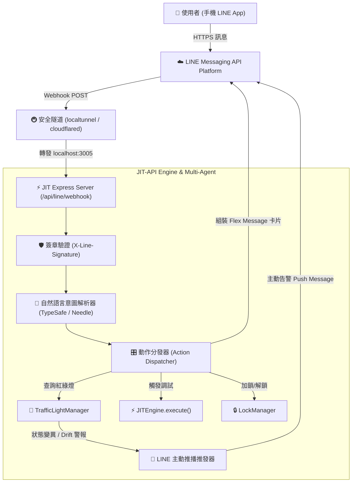

# LINE Bot 與自然語言協同溝通架構規劃指南 (LINE Bot Architecture Plan)

> **版本**：v1.3.0  
> **核心目標**：為非工程師（PM、QA、營運主管）提供最友善的對話式工作入口。使用者只需在本地填入憑證，執行 `./run.sh`，系統便會自動建立安全隧道並打通 LINE Bot 溝通管道。

---

## 一、設計哲學：零繁瑣配置、一鍵直通 (Zero-Hassle Onboarding)

傳統 LINE Bot 串接通常需要配置公網伺服器、申請 SSL 證書、設定反向代理，門檻極高。  
JIT-API 採用 **「配置即啟用（Config-and-Play）」** 的架構：

```
                    ┌───────────────────────────────────────────┐
                    │ 1. 填寫本地 .env (已列入 .gitignore 絕不上傳) │
                    │    LINE_CHANNEL_SECRET=...                │
                    │    LINE_CHANNEL_ACCESS_TOKEN=...          │
                    └─────────────────────┬─────────────────────┘
                                          │
                                          ▼
                    ┌───────────────────────────────────────────┐
                    │ 2. 執行 ./run.sh                          │
                    │    自動偵測 LINE 憑證                     │
                    │    自動啟動 HTTPS 安全隧道 (localtunnel)   │
                    └─────────────────────┬─────────────────────┘
                                          │
                                          ▼
                    ┌───────────────────────────────────────────┐
                    │ 3. 終端輸出 Webhook URL                   │
                    │    👉 https://jit-xxxx.loca.lt/api/line/  │
                    │    貼入 LINE Developers 後台即完成對接！   │
                    └───────────────────────────────────────────┘
```

---

## 二、端到端架構拓撲圖 (Architecture Topology)



---

## 三、設定檔規劃 (`.env` 與安全防護)

在專案目錄下的 `.env`（已於 `.gitignore` 嚴格隔離）新增以下欄位：

```bash
# ==============================================================================
# LINE Bot 整合設定 (選配：填寫後執行 ./run.sh 即自動打通)
# ==============================================================================
LINE_ENABLED=true
LINE_CHANNEL_SECRET=your_channel_secret_here
LINE_CHANNEL_ACCESS_TOKEN=your_channel_access_token_here

# 隧道服務 (預設 localtunnel，亦支援 cloudflared 或 ngrok)
TUNNEL_PROVIDER=localtunnel
TUNNEL_SUBDOMAIN=jit-studio-myteam  # 可選固定子網域
```

> [!CAUTION]
> **資安守則**：
> 1. `LINE_CHANNEL_SECRET` 與 `ACCESS_TOKEN` 嚴禁提交到 Git。
> 2. Webhook 收到請求時，必須使用 `LINE_CHANNEL_SECRET` 配合 HMAC-SHA256 驗證 `X-Line-Signature`，任何偽造請求立即拒絕（401 Unauthorized）。

---

## 四、`run.sh` 啟動腳本自動化邏輯

未來於 `run.sh` 中只需加入以下直觀的判斷邏輯：

```bash
#!/usr/bin/env bash
set -e

echo "⚡ 正在啟動 JIT Protocol Synthesis Studio..."

# 1. 啟動後端 JIT Engine & Web Studio
node bin/cli.js dev &
SERVER_PID=$!

# 2. 偵測是否已配置 LINE Bot 憑證
if grep -q "LINE_CHANNEL_SECRET" .env 2>/dev/null && [ -n "$LINE_CHANNEL_SECRET" ]; then
    echo "📱 偵測到 LINE Bot 憑證，正在建立安全的 HTTPS Webhook 隧道..."
    
    # 使用 npx 免安裝直接啟動 localtunnel
    npx -y localtunnel --port 3005 --subdomain "${TUNNEL_SUBDOMAIN:-jit-local}" > /tmp/jit_tunnel.log 2>&1 &
    TUNNEL_PID=$!
    
    sleep 3
    TUNNEL_URL=$(grep -o 'https://[^ ]*' /tmp/jit_tunnel.log | head -n 1)
    
    echo "================================================================="
    echo "🎉 LINE Bot 隧道建立成功！"
    echo "👉 請至 LINE Developers 將 Webhook URL 設定為："
    echo "   ${TUNNEL_URL}/api/line/webhook"
    echo "👉 並開啟「Use Webhook」開關"
    echo "================================================================="
fi

# 監聽關閉訊號
trap "kill $SERVER_PID $TUNNEL_PID 2>/dev/null; exit 0" SIGINT SIGTERM
wait
```

---

## 五、LINE Bot 支援之對話指令與互動情境

非技術人員（如 PM、QA）可以像在跟智慧特助聊天一樣，直接透過對話掌握整個工程狀態：

### 1. 查詢 API 協調燈號與狀態
* **使用者輸入**：「狀態」、「API 清單」、「現在可以測試嗎？」
* **LINE 回覆 (Flex Message 儀表板卡片)**：
  ```
  ╔═════════════════════════════════════════╗
  ║ 🚦 JIT API 即時協同看板                ║
  ╠═════════════════════════════════════════╣
  ║ 🟢 create_order                         ║
  ║    狀態: SYNCED (Phase 3 靜態極速 <1ms)  ║
  ║    權限: 雙端皆可編輯 / 可調用          ║
  ╟─────────────────────────────────────────╢
  ║ 🟡 get_balance                          ║
  ║    狀態: NEGOTIATING (樣本演進 2/3)      ║
  ║    提示: Client 剛發送新欄位，收斂中     ║
  ╟─────────────────────────────────────────╢
  ║ 🔴 checkout_cart                        ║
  ║    狀態: LOCKED (Server 壓測進行中)     ║
  ║    提示: 請稍候再修改請求 (剩餘 24 秒)   ║
  ╚═════════════════════════════════════════╝
  ```

### 2. 口語發起功能驗收測試
* **使用者輸入**：「幫我測試 create_order，金額 500 元，刷卡」
* **JIT-API 動作**：AI 自動解析意圖，呼叫 `JITEngine.execute()`。
* **LINE 回覆**：
  ```
  ✅ 測試執行成功！
  • 訂單編號: ORD-492104
  • 金額: $500
  • 付款方式: CREDIT_CARD
  • 執行耗時: 0.8ms (Phase 3 靜態路徑)
  • 自動修復: 無
  ```

### 3. 主動告警推播 (Push Notification)
當後端在開發或生產中發生異常漂移（Drift）或進入紅燈時，系統會**主動推播**至專案負責人的 LINE：
> ⚠️ **【JIT 協同警報】路由 `checkout_cart` 亮起紅燈！**  
> **原因**：後端工程師已獲取鎖定，正在執行 Grafana k6 壓力測試 (50 VUs)。  
> **建議**：前端請暫停發送變異結構請求，避免溜溜球效應衝突。

---

## 六、多通訊軟體 (ChatOps) 的橫向擴充性

本架構在介面設計上採用抽象 Adapter 模式：
* 測試初期以最普及的 **LINE Bot** 為核心。
* 未來若團隊需要切換或同時支援 **Discord、Slack、Telegram、Teams**，只需實作對應的 `ChatAdapter`，核心的 `TrafficLightManager`、`JITEngine` 與 `IntentParser` 皆可 100% 複用！
