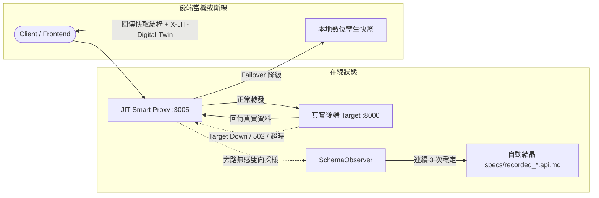

# JIT Smart Mock Server、Mock Client 與 旁路錄製數位孿生指南

> **JIT 協定合成框架（jit-api v1.3.0）** 擴充功能：  
> *Zero-Backend Rapid Prototyping ➔ Synthetic Traffic & Chaos Verification ➔ Passive Recording & Digital Twin Failover*

---

## 📖 核心理念與三合一角色

在微服務與現代前後端分離架構中，開發團隊常常面臨以下三大痛點：
1. **後端尚未開發，前端無從開工**：前端工程師只能手動在代碼裡 hardcode 假資料，日後對接時又要耗費大量時間抽換與除錯。
2. **後端已上線，但難以驗收極端邊界流量**：手動撰寫 Postman 或單元測試無法覆蓋欄位大小寫突變、型別字串化或意外缺漏。
3. **第三方或舊有系統難以逆向取得規格**：外部 API 規格文件陳舊甚至遺失，串接時如履薄冰，遇到第三方服務斷線時整套系統更陷入癱瘓。

**JIT-API v1.3.0 全新推出三合一工具組**：
- **🎭 Smart Mock Server**：讀取 `specs/*.api.md`，自動合成具備語意真實度的模擬資料（UUID、ISO 日期、Email、金額），支援 REST 與 ConnectRPC，並自帶 Phase 3 快速結晶（0ms 延遲回應）！
- **🤖 Smart Mock Client**：自動根據規格發送合成流量，支援 `valid`（合規驗收）、`fuzz`（變換 camelCase 與字串化數字驗收 JIT Auto-Repair）、`chaos`（欄位突變與缺失），並自動輸出統計報告。
- **🛰️ Smart Proxy Recorder & Digital Twin**：旁路攔截真實流量，自動雙向觀察 Request/Response，達標後自動結晶出 `specs/recorded_*.api.md` 規格檔；**當真實後端當機或斷線時，代理自動無縫降級為本地「數位孿生」**，保障展示與開發零中斷！

---

## 🚀 1. Smart Mock Server（零後端即刻開工）

### CLI 啟動方式
```bash
# 預設載入 ./specs 目錄，在 3005 埠啟動
npx jit-api mock

# 自訂埠號與規格目錄
npx jit-api mock --port 8080 --specs ./my-specs
```

### 支援協議
Mock Server 原生具備雙協議支援：
1. **REST JSON 端點**：
   ```bash
   POST http://localhost:3005/api/mock/create_order
   Content-Type: application/json

   { "item": "Mechanical Keyboard" }
   ```
   *回應標頭包含*：
   - `X-JIT-Mock: true`
   - `X-JIT-Phase: phase3_static`（當連續呼叫達標後自動結晶，回應延遲 < 1ms）

2. **ConnectRPC 端點**：
   - 通用端點：`POST http://localhost:3005/jit.v1.JITService/Execute`
   - 具名端點：`POST http://localhost:3005/jit.v1.JITService/CreateOrder`

### 資料生成規則
- 若規格書中包含 `## Mock` 區塊，優先採用其定義之結構。
- 若規格書中包含 `## Sample`，自動參考 Sample Payload 與 Response。
- 根據欄位名稱自動進行語意識別：
  - `email` ➔ `user@example.com`
  - `id` / `order_id` ➔ `uuid` 或 `ord-xxxxxx`
  - `price` / `amount` ➔ 合理數值（如 `99.99`）
  - `date` / `createdAt` ➔ ISO 8601 時間字串
  - `status` ➔ `SUCCESS` / `CONFIRMED`

---

## 🤖 2. Smart Mock Client（合成與混沌流量驗收）

### CLI 執行方式
```bash
# 對指定後端發送 5 筆合規合成流量
npx jit-api mock-client --target http://localhost:3000

# 針對特定路由發送 Fuzz 流量（驗收 JIT Auto-Repair 自適應修復能力）
npx jit-api mock-client --target http://localhost:3000 --route create_order --mode fuzz --count 10

# 發送 Chaos 混沌突變流量
npx jit-api mock-client --target http://localhost:3000 --mode chaos --count 20
```

### 三種流量模式說明
| 模式 (`--mode`) | 行為特性 | 驗收目標 |
| :--- | :--- | :--- |
| `valid` | 嚴格按照 `specs/` 定義產出合法型態資料 | 驗收伺服器正常業務流程與 Phase 3 凍結 |
| `fuzz` | 故意將 snake_case 轉為 camelCase，或將數字改為字串 `"100"` | 驗收 JIT `AutoRepairer` 欄位對齊與型別轉化能力 |
| `chaos` | 注入非法型別、破壞結構或移除必填欄位 | 驗收 API 邊界防禦與 400/422 錯誤處理 |

### 驗收報告範例
```text
==================================================
📊 JIT Smart Mock Client 測試報告
==================================================
- 目標位址: http://localhost:3000
- 測試模式: fuzz
- 總請求數: 10
- 成功次數: 10
- 失敗次數: 0
- 成功率  : 100.0%
- 平均延遲: 1.25 ms
- 狀態碼分布:
    [200]: 10 次
==================================================
🎉 所有測試請求已順利完成！
```

---

## 🛰️ 3. Smart Proxy Recorder & 數位孿生（旁路錄製與離線容錯）

### CLI 啟動方式
```bash
# 旁路錄製真實後端（代理監聽於 3005，轉發至真實後端）
npx jit-api proxy --target https://api.prod-backend.com

# 指定錄製規格目錄與監聽埠
npx jit-api proxy --target http://localhost:8000 --port 3005 --specs ./specs

# 強制以純離線「數位孿生」模式運作（不轉發，全數走本地孿生快照）
npx jit-api proxy --target http://localhost:8000 --offline
```

### 工作原理


### 自動結晶規格書
當客戶端透過 Proxy 對同一路徑（如 `/api/orders`）發送請求，連續 3 筆樣本結構穩定時，Proxy Recorder 會自動在 `specs/` 產出對應規格檔：
```markdown
# API: api_orders
Version: 1.0.0
Stage: dev
> Auto-recorded from live traffic by JIT Proxy Recorder

## Intent
Auto-recorded API endpoint for api_orders

## Fields
- item: string
- quantity: number

## Sample
- Payload:
```json
{
  "item": "Mechanical Keyboard",
  "quantity": 1
}
```

## Mock
```json
{
  "order_id": "REAL-ORD-12345",
  "status": "PAID"
}
```
```

### 斷線自動容錯（Failover to Digital Twin）
當後端服務進行維護、網路中斷或伺服器當機時：
- 代理伺服器捕獲連線異常（`fetch failed` / `ECONNREFUSED`）。
- 自動無縫切換至 **本地數位孿生（Digital Twin）**。
- 回應標頭標記 `X-JIT-Digital-Twin: true` 與 `X-JIT-Reason: failover`。
- 前端網頁與應用程式可維持正常渲染與展示，避免出現整頁白屏或網路崩潰！

---

## 💻 4. TypeScript 程式碼整合呼叫

除了 CLI，您也可以在自訂的 Node.js 程式中直接引入模組：

```typescript
import { MockServer, MockClient, ProxyRecorder } from 'jit-api';

// 1. 啟動 Mock Server
const mockServer = new MockServer({ specsDir: './specs', port: 3005 });
await mockServer.start();

// 2. 使用 Mock Client 驗收
const client = new MockClient({ specsDir: './specs', targetUrl: 'http://localhost:3005' });
const report = await client.runSuite({ mode: 'fuzz', count: 10 });
console.log(`成功率: ${report.successRate}%`);

// 3. 啟動 Proxy Recorder
const proxy = new ProxyRecorder({
  targetUrl: 'http://my-real-service.internal',
  port: 3000,
  autoFailover: true,
});
await proxy.start();
```
