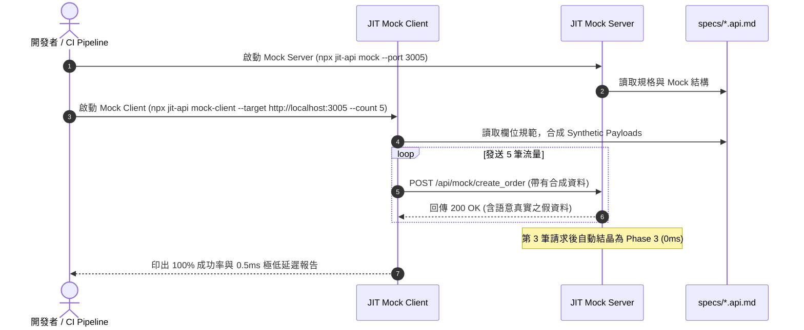

# JIT Smart Mock 完整使用指南：Mock Server 與 Mock Client 實戰

> **JIT 協定合成框架（jit-api v1.3.0）核心能力**  
> *零後端即刻開工（Mock Server） ✕ 合成與混沌流量驗收（Mock Client）*

---

## 🧭 導覽地圖：該用哪一個？

在 API 生命週期中，根據您目前扮演的角色與遇到的問題，選擇對應的 JIT Mock 工具：

```text
┌────────────────────────────────────────────────────────────────────────┐
│                        JIT Smart Mock 角色決策樹                         │
└────────────────────────────────────────────────────────────────────────┘
                                    │
           ┌────────────────────────┴────────────────────────┐
           ▼                                                 ▼
   【我需要一個假後端】                              【我需要大量假流量測後端】
           │                                                 │
   👉 使用 Mock Server                               👉 使用 Mock Client
   -----------------                                 -----------------
   • 後端還在開發中，前端想先開工                    • 後端剛寫好，需要驗收正常功能
   • 需要向主管/客戶展示 UI Demo                     • 想要測 JIT 的欄位自適應修復 (Fuzz)
   • 支援 REST 與 ConnectRPC                         • 想要做例外與邊界防禦測試 (Chaos)
   • 3 次呼叫自動結晶至 0ms 靜態回應                 • 自動產出成功率與延遲統計報告
```

---

## 🎭 第一部分：Mock Server 該怎麼用？

### 1. 核心場景
* **前端先行**：後端工程師還在切資料庫或寫商業邏輯，前端工程師已經可以對接真實的 API 路由。
* **高擬真展示**：自動生成包含 Email、UUID、金額、ISO 建立時間等合乎真實業務語意的假資料。
* **極致效能**：連續呼叫 3 次後，JIT 引擎自動將 Mock 路由凍結至 **Phase 3 Fast-Path**，回應延遲降至 0ms！

---

### 2. 準備 Markdown 規格書 (`specs/*.api.md`)
Mock Server 會自動讀取 `specs/` 目錄下的規格。資料生成依據以下優先級：

1. **優先級 1：定義了 `## Mock`**（精準回傳自訂結構）
2. **優先級 2：定義了 `## Sample`**（提取範例中的 Payload 與 Response）
3. **優先級 3：僅定義了 `## Fields`**（依據欄位名稱與型別進行啟發式語意合成）

#### 範例：`specs/order_service.api.md`
```markdown
# API: create_order
Version: 1.0.0
Stage: dev
> 訂單建立 API

## Intent
User wants to place an order for items

## Fields
- customer_email: string (消費者信箱)
- item_name: string (購買品項)
- amount: number (結帳金額)
- payment_method: enum (付款方式)
  - CREDIT_CARD: 信用卡
  - LINE_PAY: 行動支付

## Sample
- Payload:
```json
{
  "customer_email": "alice@example.com",
  "item_name": "Mechanical Keyboard",
  "amount": 2500,
  "payment_method": "LINE_PAY"
}
```

## Mock
```json
{
  "order_id": "ORD-998877",
  "status": "PAID",
  "receipt_url": "https://invoice.example.com/receipt/998877.pdf"
}
```
```

> [!TIP]
> 如果沒有寫 `## Mock` 區塊，Mock Server 會根據欄位名稱自動智慧推論：
> * `email` / `customer_email` ➔ 自動產出 `user_xxxx@example.com`
> * `id` / `order_id` ➔ 自動產出 UUID 或 `ord_xxxx`
> * `amount` / `price` ➔ 自動產出合理數值（如 `99.99`）
> * `date` / `createdAt` ➔ 自動產出 ISO 8601 時間字串（如 `2026-09-23T08:00:00.000Z`）

---

### 3. 啟動 Mock Server

#### 方式 A：透過 CLI 指令（最推薦）
```bash
# 1. 預設啟動：讀取 ./specs 目錄，綁定 Port 3005
npx jit-api mock

# 2. 自訂 Port 與規格目錄
npx jit-api mock --port 8080 --specs ./my-specs
```

啟動後控制台將顯示：
```text
🎭 JIT Smart Mock Server running at http://localhost:3005
📦 Serving 1 specs from /path/to/specs
   - REST endpoint:       POST http://localhost:3005/api/mock/:route
   - ConnectRPC endpoint: POST http://localhost:3005/jit.v1.JITService/:method
⚡ Auto-crystallizes mock routes to Phase 3 Fast-Path (0ms) after 3 stable calls.
```

#### 方式 B：在 Node.js / TypeScript 程式碼中嵌入
```typescript
import { MockServer } from 'jit-api';

const mockServer = new MockServer({
  specsDir: './specs',
  port: 3005,
  stabilityThreshold: 3, // 連續 3 筆呼叫後自動結晶為 0ms 靜態回應
});

const serverUrl = await mockServer.start();
console.log(`Mock Server is ready at ${serverUrl}`);

// 結束時可優雅關閉
// await mockServer.stop();
```

---

### 4. 前端調用方式

#### ① REST JSON 調用
對應路徑規則：`POST /api/mock/{route_name}`

```bash
curl -X POST http://localhost:3005/api/mock/create_order \
  -H "Content-Type: application/json" \
  -d '{
    "customer_email": "test@domain.com",
    "item_name": "Screen",
    "amount": 8000
  }'
```

**回傳 Response：**
```json
{
  "order_id": "ORD-998877",
  "status": "PAID",
  "receipt_url": "https://invoice.example.com/receipt/998877.pdf"
}
```

**HTTP 回傳標頭說明：**
* `X-JIT-Mock: true`：明確標記此為 JIT 合成之 Mock 回應。
* `X-JIT-Phase: phase1_dynamic`（前 1~2 次呼叫，動態推算資料）。
* `X-JIT-Phase: phase3_static`（第 3 次呼叫起，已結晶至靜態快照，0ms 延遲回應）。

#### ② ConnectRPC 調用（gRPC-Web / Connect Protocol）
Mock Server 同步掛載 ConnectRPC 服務，跨服務或瀏覽器前端可直接使用 Connect Client：

* **通用 RPC 入口**：
  ```bash
  curl -X POST http://localhost:3005/jit.v1.JITService/Execute \
    -H "Content-Type: application/json" \
    -d '{
      "route": "create_order",
      "payload": { "item_name": "Mouse", "amount": 600 }
    }'
  ```
* **具名 RPC 入口**：
  ```bash
  curl -X POST http://localhost:3005/jit.v1.JITService/CreateOrder \
    -H "Content-Type: application/json" \
    -d '{ "item_name": "Mouse", "amount": 600 }'
  ```

---

## 🤖 第二部分：Mock Client 該怎麼用？

### 1. 核心場景
* **後端冒煙驗收**：後端 API 剛寫好，無需手動打開 Postman 一個個欄位複製貼上，Mock Client 自動依據規格注入真實測試資料。
* **自適應修復（Auto-Repair）驗收**：故意送出不同命名風格（如 `camelCase`）或字串數字，驗收 JIT 後端是否能 100% 自動容錯。
* **強韌度與混沌測試**：故意移除欄位或灌入型別不符資料，檢驗系統是否能優雅攔截並回傳 400。

---

### 2. 三種流量模式說明

| 模式參數 (`--mode`) | 流量行為 | 驗收核心目標 |
| :--- | :--- | :--- |
| **`valid`**（預設） | 嚴格依照 `specs/` 欄位型態產出合法 Payload | 驗收後端正常商業邏輯、觸發 Phase 3 快速結晶 |
| **`fuzz`** | 1. 欄位自動由 `snake_case` 轉為 `camelCase`<br>2. 數值型態強制轉為字串（如 `100` 轉 `"100"`） | **專門檢驗 JIT `AutoRepairer` 的自我修復能力**（確認後端不會噴 500） |
| **`chaos`** | 1. 隨機替換為非法型態（數字變物件、字串變布林）<br>2. 隨機丟失非必填或必填欄位 | 檢驗伺服器邊界防禦機制、400 驗證回報與容錯彈性 |

---

### 3. 執行 Mock Client

#### 方式 A：透過 CLI 指令（最推薦）

```bash
# 1. 基礎驗收：對指定目標伺服器發送 5 筆合法測試請求
npx jit-api mock-client --target http://localhost:3000

# 2. 指定測試特定路由
npx jit-api mock-client --target http://localhost:3000 --route create_order

# 3. Fuzz 自適應修復驗收（發送 10 筆大小寫改異與轉型流量）
npx jit-api mock-client --target http://localhost:3000 --mode fuzz --count 10

# 4. Chaos 混沌邊界測試（發送 20 筆極端異常流量）
npx jit-api mock-client --target http://localhost:3000 --mode chaos --count 20
```

#### 方式 B：在 Node.js / TypeScript 測試腳本中嵌入
您可以在 Vitest、Jest 或 CI 腳本中直接呼叫 `MockClient` 進行自動化驗收：

```typescript
import { MockClient } from 'jit-api';

const client = new MockClient({
  specsDir: './specs',
  targetUrl: 'http://localhost:3000',
});

// 發送單一合成請求
const singleRes = await client.sendMockRequest('create_order', 'valid');
console.log('單次結果:', singleRes.status, singleRes.body);

// 執行整套整合驗收測試
const report = await client.runSuite({
  mode: 'fuzz',
  count: 10,
  route: 'create_order',
});

console.log(`測試結果：成功率 ${report.successRate}%，平均延遲 ${report.avgLatencyMs}ms`);
```

---

### 4. 測試報告解析

執行 `runSuite` 或 CLI 完成後，Mock Client 會輸出結構化報告：

```text
==================================================
📊 JIT Smart Mock Client 測試報告
==================================================
- 目標位址: http://localhost:3000
- 測試模式: fuzz
- 總請求數: 10
- 成功次數: 10
- 失敗次數: 0
- 成功率  : 100.0%
- 平均延遲: 1.42 ms
- 狀態碼分布:
    [200]: 10 次
==================================================
🎉 所有測試請求已順利完成！
```

* **成功率（Success Rate）**：HTTP 狀態碼為 2xx 視為成功。在 `fuzz` 模式下，若後端掛載了 JIT-API，成功率應維持在 **100%**（代表 Auto-Repair 發揮功效）。
* **狀態碼分布**：在 `chaos` 模式下，預期應看到大量 `[400]` 或 `[422]`，若出現 `[500]` 則代表後端程式碼有未防護的 Unhandled Exception，需儘速修復。

---

## ⚡ 第三部分：進階實戰——Mock Client ✕ Mock Server 閉環驗收

您甚至**不需要寫任何一行後端程式碼**，就能直接讓 Mock Client 對打 Mock Server，完成前端與規格的早期驗收！



**操作步驟：**
```bash
# 終端機視窗 1：啟動 Mock Server
npx jit-api mock --port 3005

# 終端機視窗 2：啟動 Mock Client 對打驗收
npx jit-api mock-client --target http://localhost:3005 --mode valid --count 5
```

---

## 🛰️ 第四部分：與 Proxy Recorder 聯動（錄製真實流量變 Mock）

如果您正在對接現有的舊系統或第三方 API，但手邊沒有規格書：

1. **啟動代理錄製真實流量**：
   ```bash
   npx jit-api proxy --target https://api.real-service.com --port 3005
   ```
2. **讓前端透過代理正常操作系統**：
   連續送出 3 筆請求後，代理會自動在 `specs/` 產出 `recorded_api_orders.api.md`。
3. **拔掉網路或關閉外部服務，直接轉為 Mock**：
   ```bash
   # 直接開啟離線數位孿生模式
   npx jit-api proxy --target https://api.real-service.com --offline
   
   # 或直接將錄製好的規格作為獨立 Mock Server 運行
   npx jit-api mock
   ```

---

## 📋 第五部分：CLI 參數速查表 (Cheat Sheet)

### Mock Server (`npx jit-api mock`)
| 參數 | 說明 | 預設值 |
| :--- | :--- | :--- |
| `--port <number>` | 指定 Mock Server 監聽連接埠 | `3005` |
| `--specs <path>` | 指定 Markdown 規格書目錄 | `./specs` |

### Mock Client (`npx jit-api mock-client`)
| 參數 | 說明 | 預設值 |
| :--- | :--- | :--- |
| `--target <url>` | **(必填)** 目標伺服器完整位址（例: `http://localhost:3000`） | 無 |
| `--route <name>` | 指定測試的特定路由（未填則依序測試 `specs/` 中所有路由） | 全部 |
| `--mode <mode>` | 流量模式：`valid` \| `fuzz` \| `chaos` | `valid` |
| `--count <number>`| 每個端點發送的測試請求次數 | `5` |
| `--specs <path>` | 指定規格書目錄 | `./specs` |
